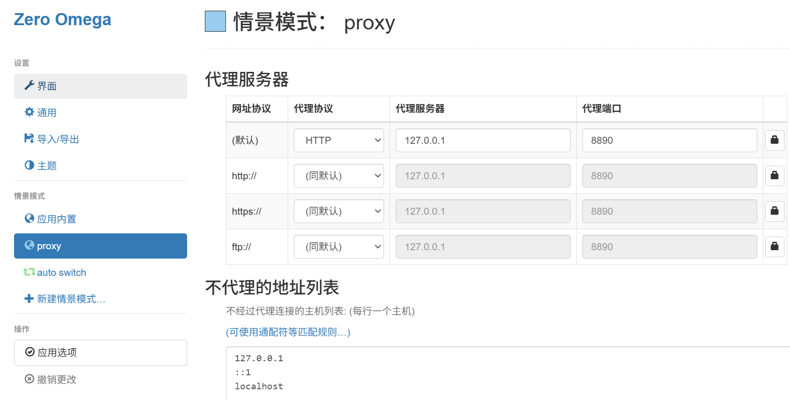
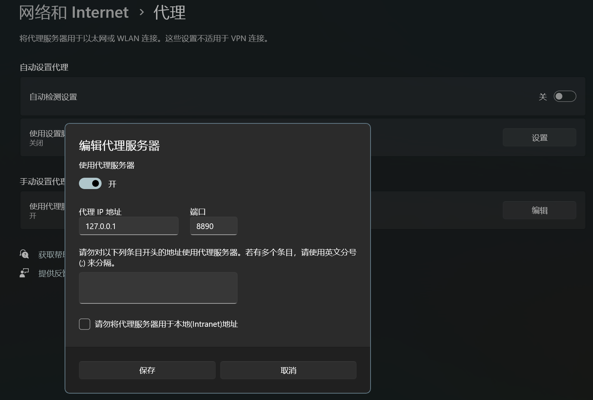

#### 启动项目
1. 切换到项目目录 `cd Computer-Network-Project`
2. 构建虚拟环境(以Windows Powershell为例)
    ```powershell
    python -m venv .venv
    .\.venv\Scripts\Activate.ps1
    pip install -r requirements.txt
    ```
3. 运行实时监控看板(以8890端口为例)
`streamlit run .\src\dashboard.py -- --proxy-port 8890 --dashboard-port 8501`
运行后应当会自动在浏览器中打开`http://localhost:8501`

#### 配置代理
任选一种：
1. 配置浏览器代理方法(以Edge浏览器为例)
- 搜索浏览器扩展商店，安装代理扩展，我使用的是`Proxy SwitchyOmega 3 (ZeroOmega)`
- 新建情景，并如图设置


2. 配置系统代理方法(以Windows系统为例)
- 设置->代理服务器设置->手动设置代理->使用代理服务器
- 如图设置
